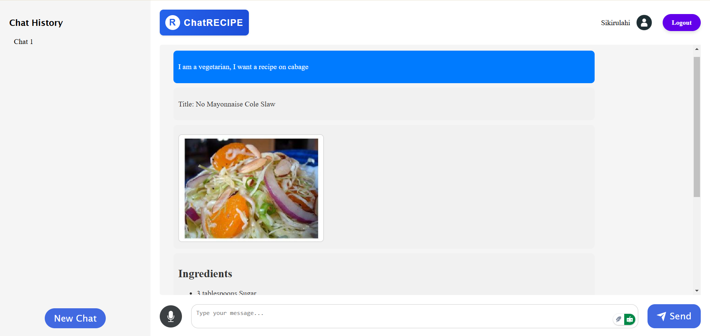

# ChatRecipe: The Recipe Generator

## Overview
ChatRecipe is an AI-powered recipe generation tool designed to deliver personalized culinary solutions. Utilizing advanced AI tool-calling (function calling) and integrating the Spoonacular API, this project provides users with detailed recipe suggestions, ingredient substitutes, conversational interactions, and transcription capabilities for audio input. Whether you're looking to explore new recipes, find ingredient alternatives, or chat hands-free, ChatRecipe adapts dynamically to your queries.

## Project Screenshot


## Key Features
1. **Recipe and Cooking Instructions**:
   - Generates recipes and step-by-step cooking instructions based on user queries.
   - Fetches data from the Spoonacular API and processes web content using AI models to provide structured and detailed results.

2. **Ingredient Substitution**:
   - Suggests substitutes for any given ingredient.
   - Sends requests to the Spoonacular API and refines the results using AI models for clarity and usability.

3. **Conversational Interaction**:
   - Engages in natural and dynamic conversations.
   - Tailors responses depending on the type of query, whether it’s recipe generation, substitution requests, or general chatting.

4. **Audio Input Transcription**:
   - Converts audio input to text for seamless interaction.
   - Enhances accessibility and provides a hands-free experience for users.

## How It Works
1. **Tool Calling Functionality**:
   - The AI model identifies the type of query and selects the appropriate tool.
   - Dynamically determines which tool to call either the Spoonacular API for recipes, substitutes or respond conversationally, or process audio input.

2. **Recipe and Cooking Ingredients**:
   - Sends a request to the Spoonacular API for recipes and cooking instructions.
   - Processes the API response, which includes a link to detailed recipe information.
   - Extracts webpage content from the link and refines it using a Large Language Model (LLM) to generate structured and user-friendly text.

3. **Ingredient Substitution**:
   - Queries the Spoonacular API for ingredient substitutes.
   - Processes the API response with an LLM to deliver clear and practical alternatives.

4. **Conversational Responses**:
   - For general queries, the AI responds based on its conversational capabilities without invoking external tools.

5. **Audio Transcription**:
   - Processes audio input using a transcription model to convert speech to text.
   - Integrates the transcribed text seamlessly into the chatbot workflow.

## Technologies Used
- **APIs**: Spoonacular API for recipe and ingredient data.
- **AI Models**:
  - OpenAI LLM
  - Cohere AI LLM
  - Hugging Face Audio Transcription Model
- **Framework**: LangChain for orchestrating tool-calling and API interactions.
- **Backend**: Flask for server-side processing.
- **Frontend**: HTML, CSS, and JavaScript for user interface.

## Installation
1. **Clone the Repository**:
   ```bash
   git clone https://github.com/Sikirulahi1/ChatRECIPE---AI-Recipe-Generator.git
   cd ChatRECIPE
   ```

2. **Set Up the Environment**:
   - Install Python (>= 3.9).
   - Create and activate a virtual environment:
     ```bash
     python -m venv env
     On Mac:source env/bin/activate
     On Windows: env\Scripts\activate
     ```
   - Install dependencies:
     ```bash
     pip install -r requirements.txt
     ```

## 3. Set Up API Keys

To use the **ChatRecipe: The Recipe Generator** app, you will need API keys for Spoonacular, Hugging Face, OpenAI, and Cohere.

### Steps to Set Up API Keys:

1. **Obtain an API Key from Spoonacular**:
   - Go to [Spoonacular API](https://spoonacular.com/food-api) and sign up for an API key.

2. **Obtain API Keys from Other Providers**:
   - [Hugging Face API Key](https://huggingface.co/settings/tokens)
   - [OpenAI API Key](https://platform.openai.com/account/api-keys)
   - [Cohere API Key](https://cohere.ai)

3. **Create a `.env` File**:
   - In the project root directory, create a `.env` file and add the following keys:
     ```env
     SPOONACULAR_API_KEY=your_spoonacular_api_key_here
     HUGGINGFACEHUB_API_TOKEN=your_huggingface_api_key_here
     OPENAI_API_KEY=your_openai_api_key_here
     COHERE_API_KEY=your_cohere_api_key_here
     ```

4. **Run the Application**:
   - After setting up the API keys in your `.env` file, you can start the application as per the instructions in the setup guide.


4. **Run the Application**:
   ```bash
   flask run
   ```
   Access the app at `http://127.0.0.1:5000/`.

## Usage
1. Launch the application and interact with the chatbot interface.
2. Query for recipes, ingredient substitutes, or have a general chat.
3. Use audio input for hands-free interaction.
4. Receive structured and detailed results tailored to your request.

### Example Queries
- **Recipe Generation**:
  *User*: "How do I make a lasagna?"
  *ChatRecipe*: Provides a structured recipe and step-by-step instructions.

- **Ingredient Substitution**:
  *User*: "What can I use instead of eggs in baking?"
  *ChatRecipe*: Suggests substitutes such as applesauce or flaxseed, with detailed usage instructions.

- **General Chat**:
  *User*: "What’s a good dessert idea for a party?"
  *ChatRecipe*: Engages conversationally to suggest popular dessert options.

- **Audio Input**:
  *User*: Speaks "Tell me how to bake cookies."
  *ChatRecipe*: Transcribes the audio, processes the query, and provides a detailed recipe.

## Future Enhancements
- **Expanded API Integration**: Incorporate additional APIs for more diverse recipe options and nutritional insights.
- **Voice Interaction**: Enable hands-free interaction using voice output.
- **Multi-Language Support**: Generate recipes and responses in multiple languages.
- **Meal Planning**: Add features for weekly meal planning and shopping list generation.

## Contribution
We welcome contributions! To contribute:
1. Fork the repository.
2. Create a new branch: `git checkout -b feature-name`.
3. Commit your changes: `git commit -m 'Add new feature'`.
4. Push to the branch: `git push origin feature-name`.
5. Submit a pull request.

<!-- ## License
This project is licensed under the [MIT License](LICENSE). -->

## Acknowledgements
- **Spoonacular API**: For providing comprehensive recipe and ingredient data.
- **AI Models**: OpenAI and Cohere for their powerful language models.
- **LangChain Framework**: For seamless tool-calling and API integration.


